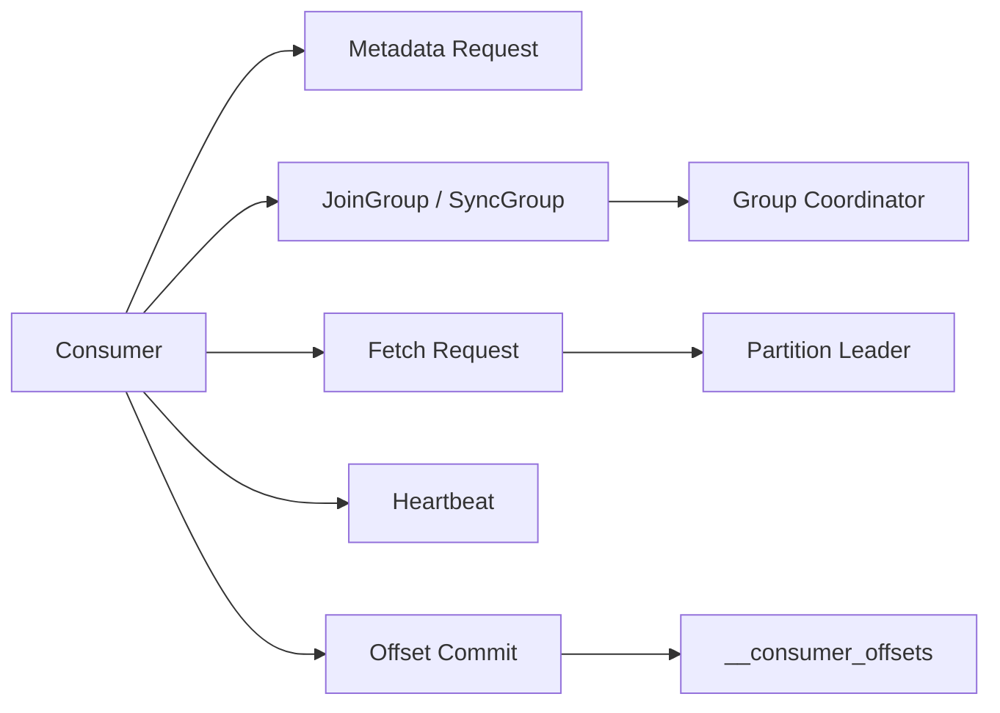

# Kafka Consumer Protocol

## Overview
Kafka consumers talk to brokers through a pull-based protocol. The consumer controls fetch size, fetch cadence, commit timing, and group membership, which is why consumer tuning directly changes throughput, latency, and recovery behavior.

## Core Request Flow
1. Consumer discovers metadata for the topic and partition leaders.
2. It joins a consumer group through the group coordinator.
3. The coordinator assigns partitions.
4. The consumer sends `Fetch` requests to the leader of each assigned partition.
5. It periodically sends heartbeats to keep its membership alive.
6. It commits offsets to `__consumer_offsets` when progress should be recorded.

## Fetch Requests
- Kafka uses pull, not push. That lets consumers absorb data at their own rate.
- Important knobs:
  - `fetch.min.bytes`: wait for at least this much data before broker responds.
  - `fetch.max.wait.ms`: upper bound on broker-side waiting.
  - `max.partition.fetch.bytes`: limit per partition in a single fetch.
  - `fetch.max.bytes`: total fetch size across partitions.
- Large fetches improve throughput but can increase tail latency and memory pressure.

## Group Coordination
- One broker acts as the group coordinator, chosen from the partition leader of the group’s key in `__consumer_offsets`.
- Consumers use:
  - `JoinGroup` to enter the group.
  - `SyncGroup` to receive assignments.
  - `Heartbeat` to prove liveness.
  - `OffsetCommit` and `OffsetFetch` for progress tracking.

## Heartbeats And Session Timeouts
- `session.timeout.ms` controls how long the coordinator waits before declaring a member dead.
- `heartbeat.interval.ms` should be comfortably smaller than the session timeout.
- If heartbeats stop because GC pauses, CPU starvation, or long blocking processing, the member is removed and rebalance starts.

## Offset Fetching And Commits
- Offsets are not stored with the message stream itself; they are written to `__consumer_offsets`.
- Committing before processing gives at-most-once behavior.
- Committing after processing gives at-least-once behavior.
- Exactly-once requires transactional coordination between consume and produce stages.

## Example
A streaming job reads partition `orders-3`:
- Last committed offset = `420`
- Fetch returns records `420` to `449`
- App processes records `420` to `449`
- It commits `450`, meaning "next record to read"

If the app crashes after processing but before committing `450`, records may be re-read after restart.

## Operational Notes
- High consumer lag with normal broker health often points to slow processing, small fetch sizes, or too few consumers.
- Repeated rebalances usually indicate unstable consumers, long GC pauses, or mis-sized timeouts.
- Fetch sessions reduce metadata overhead for repeated fetches on the same partitions.

## Interview Angle
- Kafka consumers are pull-based because backpressure belongs with the consumer.
- Offsets are a logical progress marker, not an acknowledgement that the broker deletes older data.
- Group membership and offset management are separate concerns, even though the same coordinator participates in both.

## Related
- [[04-Data Engineering Library/Kafka Deep Internals/Kafka-Consumer-Rebalancing.md]]
- [[04-Data Engineering Library/Kafka Deep Internals/Kafka-Offset-Commit-Protocol.md]]
- [[04-Data Engineering Library/Kafka Deep Internals/Kafka-Monitoring-KPIs.md]]
