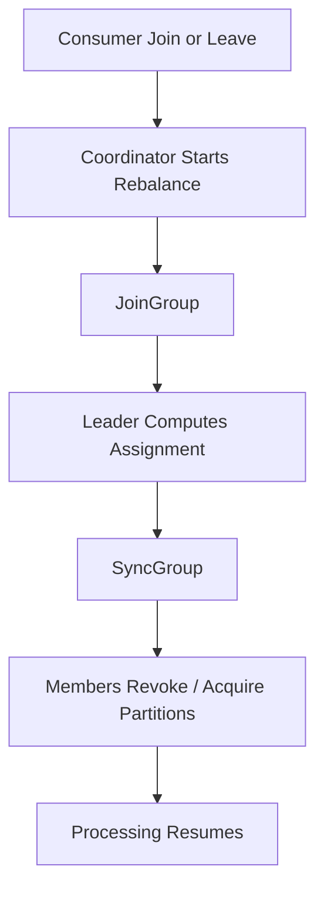

# Kafka Consumer Rebalancing

## Overview
Rebalancing is the process of redistributing partitions among members of a consumer group when membership or subscription changes. It is necessary for correctness, but it pauses or partially pauses work, so minimizing unnecessary rebalances is a major production concern.

## When Rebalances Happen
- A new consumer joins the group.
- A consumer leaves or times out.
- Topic partitions are added.
- Subscription patterns change.
- The group leader selects a different assignment after metadata changes.

## Assignment Strategies
### Range Assignor
- Groups partitions by topic and assigns contiguous ranges.
- Simple, but can be uneven when topic partition counts differ.

### Round Robin
- Spreads partitions more evenly across members.
- Can reduce hotspotting but may increase movement when group membership changes.

### Sticky Assignor
- Tries to keep previous assignments while remaining balanced.
- Good default when stability matters.

### Cooperative Sticky
- Incremental rebalance.
- Consumers revoke only partitions that must move, reducing full-stop pauses.

## Eager Vs Cooperative Rebalancing
- Eager rebalance:
  - all consumers revoke all partitions first
  - simpler but causes stop-the-world gaps
- Cooperative rebalance:
  - only moved partitions are revoked
  - better for low-latency streaming jobs

## Example
Topic `payments` has 6 partitions.

Before:
- `C1` -> `0,1,2`
- `C2` -> `3,4,5`

After `C3` joins with sticky/cooperative assignment:
- `C1` -> `0,1`
- `C2` -> `3,4`
- `C3` -> `2,5`

Only partitions `2` and `5` may move, rather than revoking all 6.

## Failure Modes
- Long message processing without `poll()` can cause `max.poll.interval.ms` violations.
- Heartbeat starvation triggers session timeout and full rebalances.
- Frequent autoscaling of consumers can create rebalance storms and lower net throughput.

## Tuning Notes
- Prefer cooperative sticky assignor for modern consumers.
- Set `max.poll.records` to match processing capacity.
- Keep `session.timeout.ms`, `heartbeat.interval.ms`, and `max.poll.interval.ms` aligned with actual workload behavior.
- Separate slow and fast workloads into different consumer groups where possible.

## Interview Angle
- Rebalancing is a coordination cost, not a data loss event by itself.
- Cooperative rebalancing matters in real systems because it reduces pause time and partition churn.
- A consumer can be healthy at the process level but still fail group membership due to poll or heartbeat deadlines.

## Related
- [[04-Data Engineering Library/Kafka Deep Internals/Kafka-Consumer-Protocol.md]]
- [[04-Data Engineering Library/Kafka Deep Internals/Kafka-Offset-Commit-Protocol.md]]
