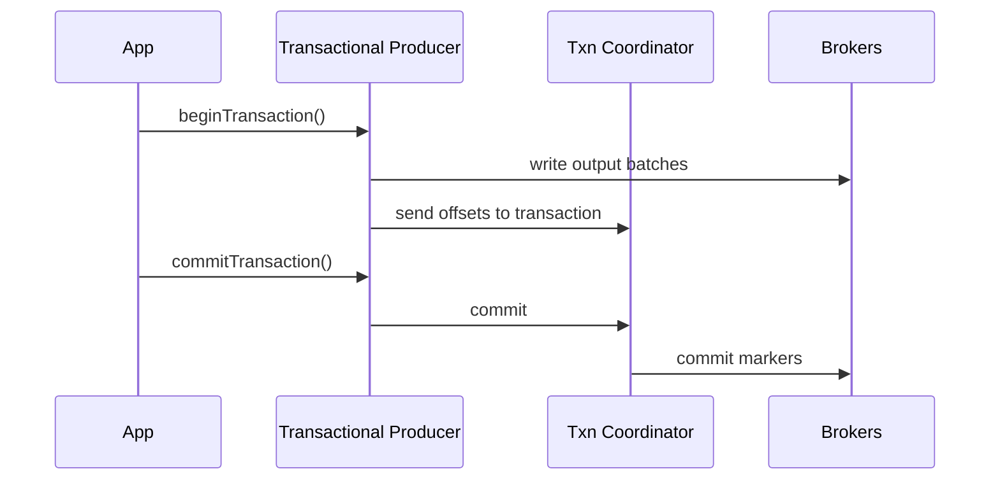

# Kafka Exactly Once Semantics

## Overview
Kafka exactly-once semantics (EOS) means a record is written to Kafka once from the perspective of downstream transactional readers, even across retries and failures. It does not mean "every side effect in the world happens exactly once."

## Building Blocks
- Idempotent producer prevents duplicates caused by retries.
- Transactions bind multiple partition writes and offset commits into one atomic unit.
- `read_committed` consumers avoid seeing aborted transactional writes.

## Transaction Flow
1. Producer gets a producer ID and epoch.
2. Producer starts a transaction.
3. It writes output records to one or more partitions.
4. It sends consumed offsets as part of the same transaction.
5. Transaction coordinator writes commit or abort markers.
6. `read_committed` consumers only read committed batches.

## What EOS Actually Guarantees
- No duplicate writes from producer retries within Kafka.
- Atomic visibility of output records and committed source offsets.
- Consumers in `read_committed` mode skip aborted transactional data.

## What EOS Does Not Guarantee
- Exactly-once writes to an external database unless that system participates in an equivalent idempotent or transactional design.
- Protection from bad application logic.
- Infinite retention of transactional state.

## Example
Pipeline:
- Consume from `orders`
- Enrich records
- Produce to `orders_enriched`
- Commit source offsets

If the app crashes after writing output but before transactional commit, the output is aborted and offsets are not committed. On restart, the source records are processed again, but no duplicate committed output appears.

## Coordinator And Markers
- The transaction coordinator tracks transactional IDs and their epochs.
- Commit and abort markers are appended to affected partitions.
- Last Stable Offset (LSO) ensures `read_committed` consumers stop before uncommitted transactional data.

## Operational Notes
- Set a stable `transactional.id` per producer instance or shard.
- Watch for transaction timeouts in slow pipelines.
- Long-running transactions hold back `read_committed` visibility and can inflate lag.

## Interview Angle
- EOS in Kafka is strongest for consume-process-produce pipelines entirely inside Kafka.
- Idempotence alone is not EOS; it solves retry duplicates but not atomic offset commit plus output write.
- `read_uncommitted` consumers can still see transactional batches before commit status is respected.

## Related
- [[04-Data Engineering Library/Kafka Deep Internals/Kafka-Producer-Reliability.md]]
- [[04-Data Engineering Library/Kafka Deep Internals/Kafka-Offset-Commit-Protocol.md]]
