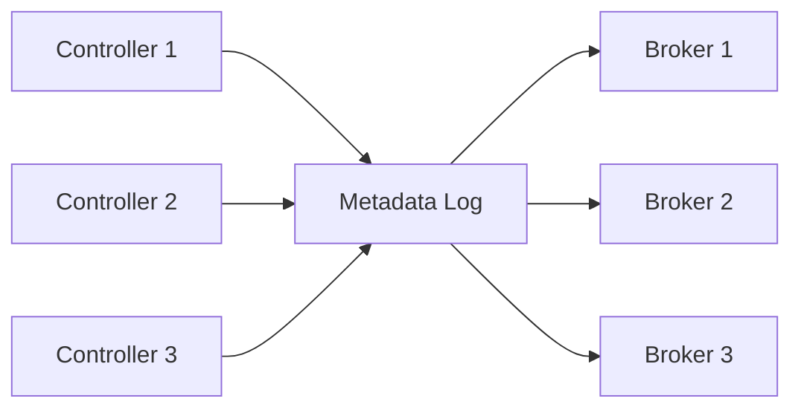

# Kafka KIP 500 Controller Quorum

## Overview
KIP-500 removes ZooKeeper from Kafka metadata management. The controller quorum stores cluster metadata in a Kafka-native Raft-based log, usually called KRaft mode.

## Why Kafka Moved Away From ZooKeeper
- Two distributed systems meant more operational complexity.
- Controller failover and metadata propagation were harder to reason about.
- Kafka wanted one consensus model for metadata inside the platform itself.

## KRaft Architecture
- Controllers form a quorum.
- One controller is active leader.
- Metadata changes are appended to a replicated metadata log.
- Brokers consume and apply metadata records from that log.

## What Lives In The Metadata Log
- Topic creation and deletion
- Partition assignments
- ISR and leader changes
- ACLs and configuration updates
- broker registrations

## Quorum Behavior
- Majority quorum is required for committed metadata changes.
- Followers replicate controller records from the active leader.
- On leader failure, a new controller leader is elected through Raft.

## Example
Three-controller quorum:
- `C1` leader
- `C2`, `C3` followers

If `C1` fails:
- `C2` and `C3` can still form majority
- one becomes new leader
- brokers continue consuming metadata once leadership stabilizes

If two controllers fail, metadata progress stops because majority is lost.

## Operational Notes
- KRaft simplifies deployments but controller quorum health becomes critical.
- Separate controller and broker roles in larger clusters for cleaner failure domains.
- Metadata log latency affects control-plane responsiveness such as partition moves and leader changes.

## Interview Angle
- KIP-500 changes the control plane, not the partition data plane.
- Raft here is for metadata consensus, not for every topic partition.
- ZooKeeper removal reduces operational overhead and failure coordination complexity.

## Related
- [[04-Data Engineering Library/Kafka Deep Internals/Kafka-Leader-Election.md]]
- [[04-Data Engineering Library/Kafka Deep Internals/Kafka-Replication-Internals.md]]
