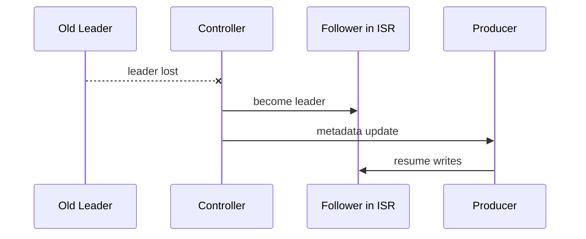

# Kafka Leader Election

## Overview
Each partition has one leader and zero or more followers. All reads and writes go through the leader, so leader election is central to availability and data safety.

## Normal Election Rules
- Preferred behavior is to pick a new leader from ISR.
- That preserves acknowledged data up to the high watermark.
- The controller coordinates leader changes and informs brokers and clients.

## Election Scenarios
### Controlled Shutdown
- A broker leaves gracefully.
- Leadership can move before the broker stops.
- Cleaner and less disruptive than crash-based failover.

### Automatic Failover
- Broker failure is detected.
- Controller chooses a replacement leader, usually from ISR.
- Clients refresh metadata and redirect traffic.

### Preferred Leader Election
- Kafka may move leadership back to preferred replicas for balance.
- Useful to spread partition leadership evenly after failures.

### Unclean Leader Election
- Allows a non-ISR replica to become leader.
- Improves availability but can lose acknowledged messages.

## Example
Partition `orders-0`:
- Replicas = `B1, B2, B3`
- Leader = `B1`
- ISR = `{B1, B2}`

If `B1` fails:
- `B2` can become leader safely
- `B3` should not become leader in a clean election because it was out of ISR

## Tradeoffs
- Clean election favors durability.
- Unclean election favors availability.
- The right choice depends on whether missing acknowledged events is acceptable.

## Operational Notes
- Monitor leader election rate; spikes often indicate broker instability.
- Too many preferred leader moves can create churn and network load.
- Slow metadata propagation can temporarily increase client errors after election.

## Interview Angle
- ISR membership is the key safety boundary for election.
- A leader election does not replicate missing data; it only selects who serves next.
- Unclean election is a business decision, not just a technical toggle.

## Related
- [[04-Data Engineering Library/Kafka Deep Internals/Kafka-ISR-Management.md]]
- [[04-Data Engineering Library/Kafka Deep Internals/Kafka-KIP-500-Controller-Quorum.md]]
