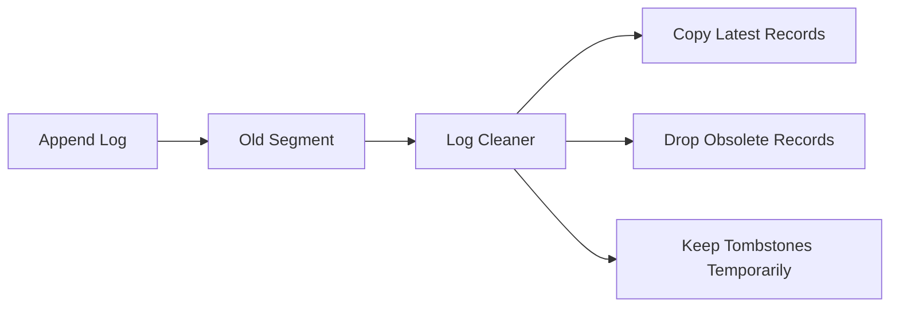

# Kafka Log Compaction Engine

## Overview
Log compaction retains the latest value for each key instead of keeping only data by age or size. It is used for changelog topics, entity snapshots, and recovery-oriented streams.

## How Compaction Works
- Kafka appends records normally.
- Cleaner threads scan inactive log segments.
- For each key, older obsolete records can be removed once a newer record exists.
- The latest record per key is preserved, plus tombstones for delete semantics until their retention expires.

## Retention Vs Compaction
- Time/size retention answers "how long do we keep data?"
- Compaction answers "what state must remain reconstructable?"
- A topic can use both.

## Tombstones
- A tombstone is a message with key and null value.
- It signals deletion for compacted topics.
- Kafka keeps tombstones for a grace period so downstream consumers have time to observe the delete.

## Example
Input records for key `user-42`:
- offset 10: `premium=false`
- offset 40: `premium=true`
- offset 85: `null` tombstone

After compaction:
- old value records can be removed
- tombstone is retained until delete retention passes
- later the tombstone can also be removed

## Cleaner Mechanics
- Cleaning happens on segments, not single records in place.
- A cleaner rewrites valid records into a clean segment and swaps files.
- Active segments are generally not compacted immediately.

## Operational Notes
- Compaction is not immediate; consumers can still see duplicate historical keys before cleaning runs.
- Very high key cardinality increases cleaner work.
- Large values and slow disks can make compaction lag visible.

## Interview Angle
- Compaction preserves latest state per key, not a perfect audit history.
- It is ideal for rebuilding state stores and caches.
- Tombstones are essential to represent deletes in a compacted log.

## Related
- [[04-Data Engineering Library/Kafka Deep Internals/Kafka-Log-Segment-Structure.md]]
- [[04-Data Engineering Library/Kafka Deep Internals/Kafka-Message-Format-Internals.md]]
