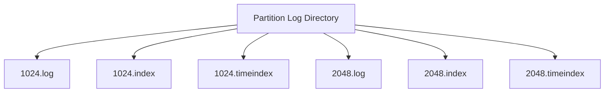

# Kafka Log Segment Structure

## Overview
Kafka stores each partition as an append-only log split into segment files. Segmenting keeps files manageable, enables index lookups, simplifies retention, and supports compaction and recovery.

## Hierarchy
```text
Topic Partition
  -> Segment
    -> Record Batch
      -> Record
```

- One partition has many segments over time.
- One segment contains many record batches.
- One record batch contains one or more records.
- A segment is a file boundary; a batch is a storage and transfer unit inside the `.log` file.

## Files Per Segment
For a base offset like `00000000000000001024`, Kafka typically creates:
- `.log` for actual record batches
- `.index` for offset-to-position lookup
- `.timeindex` for timestamp-based lookup
- `.txnindex` for transactional metadata when needed

## Segment Layout


## Why Segments Exist
- Retention can delete whole old segments cheaply.
- Indexes stay bounded in size.
- Broker restart recovery is simpler than one massive file.
- Compaction and cleaning work segment by segment.

## Index Files
- The offset index maps relative offsets to byte positions in the `.log` file.
- The time index maps timestamps to approximate positions.
- They are sparse indexes, not one entry per record.

## Example Lookup
Suppose a consumer asks for offset `1510`:
- Kafka identifies segment with base offset `1024`
- It consults `1024.index`
- Index points near the byte location in `1024.log`
- Broker scans forward until exact record batch is found

This is why lookup is fast without needing a dense index entry for every record.

## Rolling And Active Segments
- One segment is active for appends.
- When size or time threshold is hit, Kafka rolls to a new segment.
- Retention and compaction mostly act on closed segments.

## Operational Notes
- Small segment sizes increase file churn and recovery metadata overhead.
- Very large segments delay retention cleanup and compaction eligibility.
- Time-based retention deletes segments, not arbitrary old individual records inside an active segment.

## Interview Angle
- Kafka is append-only at the segment level; random in-place updates are not the storage model.
- Sparse indexes balance disk efficiency and lookup speed.
- Segment boundaries influence retention timing and compaction behavior.

## Related
- [[04-Data Engineering Library/Kafka Deep Internals/Kafka-Log-Compaction-Engine.md]]
- [[04-Data Engineering Library/Kafka Deep Internals/Kafka-Message-Format-Internals.md]]
