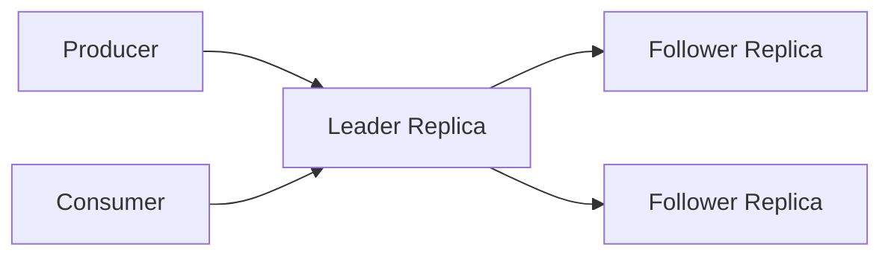

# Kafka Replication Internals

## Overview
Kafka replication copies partition data from the leader to follower replicas. This underpins durability, failover, and acknowledged write safety.

## Leader-Follower Model
- Each partition has one leader replica.
- Followers fetch data from the leader.
- Producers and consumers talk to the leader, not directly to followers, in standard operation.

## High Watermark
- The high watermark is the highest offset replicated to all required in-sync replicas.
- Consumers should only read committed data up to this boundary.
- This prevents exposing unreplicated records that could disappear after failover.

## Follower Fetching
- Followers issue fetch requests like specialized consumers.
- They persist fetched data locally.
- They periodically send their progress so the leader can track ISR membership.

## Leader Epochs And Divergence
- Leader epochs identify leadership generations.
- If a follower diverges after failover, epoch metadata helps it truncate conflicting data and realign with the new leader.

## Example
Offsets written to leader:
- leader log ends at `500`
- follower `F1` replicated to `500`
- follower `F2` replicated to `498`

If ISR requires leader + `F1` + `F2`, high watermark may stay at `498` until `F2` catches up.

## Operational Notes
- Slow followers reduce durable write progress.
- Under-replicated partitions often surface before client-visible failures.
- Replica fetcher tuning and disk health strongly affect replication quality.

## Interview Angle
- Replication is pull-based from followers, not push-based from leader.
- High watermark is central to Kafka’s durability story.
- Leader epochs solve split-brain-style log divergence during failover recovery.

## Related
- [[04-Data Engineering Library/Kafka Deep Internals/Kafka-ISR-Management.md]]
- [[04-Data Engineering Library/Kafka Deep Internals/Kafka-Leader-Election.md]]
