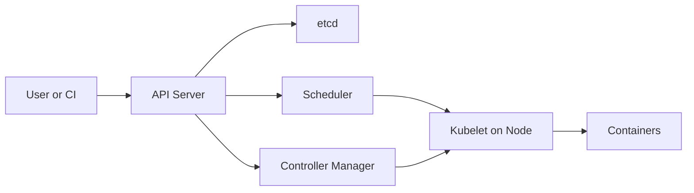

# Kubernetes Architecture

## Overview
Kubernetes is an API-driven orchestration system built around desired state and reconciliation loops. The control plane decides what should exist, while node agents make that state real by running pods on worker machines.

## Control Plane Components
- API server is the front door for cluster state changes.
- etcd stores persistent cluster metadata and desired state.
- Scheduler assigns unscheduled pods to nodes.
- Controller manager runs control loops for Deployments, ReplicaSets, Jobs, and more.

## Node Components
- Kubelet ensures pods assigned to the node are running.
- Container runtime launches containers.
- Network components provide pod connectivity and service routing.

## Mental Model
1. User submits desired state to the API server.
2. State is stored in etcd.
3. Controllers observe differences between desired and actual state.
4. Scheduler assigns pending pods to nodes.
5. Kubelets start containers and report status back.

## Why This Model Scales
- Declarative APIs simplify automation.
- Controllers separate concerns across workload types.
- Nodes do not need full global cluster knowledge to run assigned pods.

## Operational Notes
- Many issues are control-plane healthy but workload unhealthy, or vice versa.
- etcd health matters because it is the source of truth.
- Kubernetes is a distributed control system before it is a developer platform.

## Interview Angle
- Kubernetes does not "run containers directly"; it coordinates components that do.
- Desired state and reconciliation are more important than any single object type.
- The API server is central because nearly everything flows through it.

## Related
- [[04-Data Engineering Library/Kubernetes and Docker Deep Internals/Kubernetes-Controllers-and-Reconciliation.md]]
- [[04-Data Engineering Library/Kubernetes and Docker Deep Internals/Kubernetes-Scheduler-and-Placement.md]]
