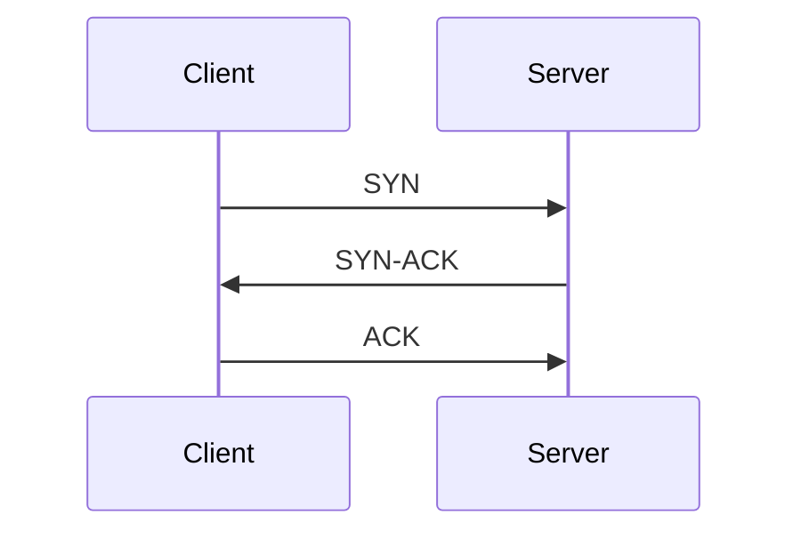

# Networking TCP Connection Lifecycle

## Overview
TCP gives applications a reliable ordered byte stream, but that abstraction hides a lot of work. Connection setup, flow state, retransmissions, and teardown all influence latency and resource usage.

## Three-Way Handshake
- Client sends `SYN`
- Server replies `SYN-ACK`
- Client replies `ACK`

Only after this handshake is the connection fully established.

## Why Setup Cost Matters
- New connections pay at least one RTT before application data flows.
- TLS usually adds more negotiation overhead unless resumed.
- High connection churn consumes ephemeral ports, accept queues, and kernel memory.

## Data Transfer Model
- TCP is a byte stream, not a message protocol.
- The receiver may read data in chunks that do not match sender write boundaries.
- Applications needing message framing must add their own protocol structure.

## Connection Teardown
- Graceful close uses `FIN` exchange.
- Abrupt failure or forced close often surfaces as `RST`.
- Closed sockets may remain in `TIME_WAIT` to prevent old packets from corrupting new connections.

## Practical Example
An internal service makes one short request per TCP connection:
- handshake cost dominates request time
- TLS setup adds more overhead
- connection churn increases CPU and kernel bookkeeping

If the same service uses pooled persistent connections, both latency and CPU cost typically improve.

## Operational Notes
- Accept queue overflow causes connection failures before the app even handles the request.
- Slow readers or writers can keep sockets open and consume memory.
- Idle timeout mismatches between client, proxy, and server create mysterious resets.

## Interview Angle
- TCP reliability is implemented with sequence numbers, acknowledgements, retransmissions, and windowing.
- Connection setup and teardown are not free, which is why keepalive and pooling matter.
- TCP gives ordered bytes, not application messages.

## Related
- [[04-Data Engineering Library/OS and Networking/Networking-Connection-Pooling-Keepalive.md]]
- [[04-Data Engineering Library/OS and Networking/Networking-Flow-Control-Congestion-Backpressure.md]]
