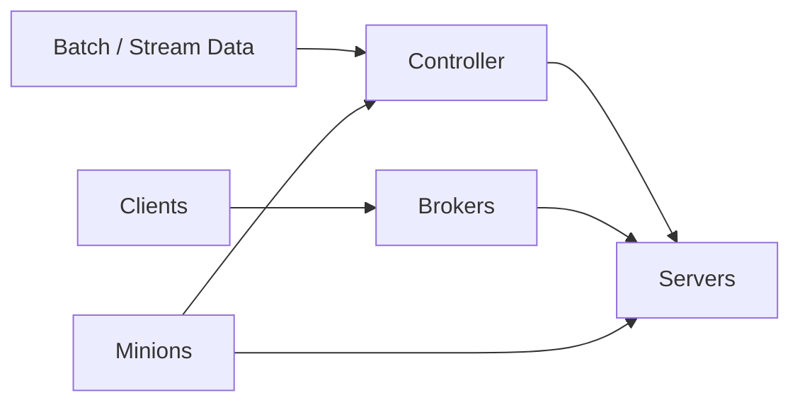

# Pinot Architecture

## Overview
Pinot separates metadata management, query routing, data serving, and background maintenance into different node roles. That lets it scale reads and ingestion independently while keeping cluster coordination centralized.

## Core Components
- Controller manages schemas, table configs, segment assignment, and ingestion-related metadata.
- Broker accepts SQL queries, determines which segments are relevant, fans requests out to servers, and merges results.
- Server stores offline and realtime segments and performs filter, aggregation, and group-by execution.
- Minion runs asynchronous maintenance tasks such as merge-rollup, purge, and conversion jobs.

## Data Flow
1. Data arrives through batch load or realtime stream ingestion.
2. Controller coordinates metadata and segment lifecycle.
3. Servers load segments and expose them for query execution.
4. Brokers route user queries to the right servers and combine partial results.

## Why This Split Matters
- Brokers can scale with query concurrency.
- Servers can scale with data volume and scan pressure.
- Controllers stay focused on metadata and orchestration.
- Minions keep heavy maintenance work off the serving path.

## Operational Notes
- A healthy Pinot cluster depends on both good segment distribution and good broker routing.
- Controllers are control-plane nodes, not query-serving nodes.
- Background tasks can materially affect storage efficiency and performance over time.

## Interview Angle
- Pinot architecture is optimized for serving analytics fast, not for OLTP-style row updates.
- Brokers do not store data; servers do.
- Segment is the most important execution boundary to remember.

## Related
- [[04-Data Engineering Library/Pinot Deep Internals/Pinot-Segment-Internals.md]]
- [[04-Data Engineering Library/Pinot Deep Internals/Pinot-Query-Routing-and-Execution.md]]
