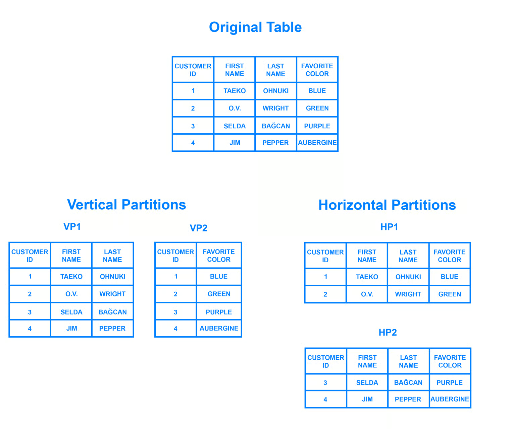

# Other RDBMS Concepts

## What is Sharding?

Sharding is a database architecture pattern related to horizontal partitioning - the practice of separating one table’s rows into multiple different tables, known as partitions. Each partition has the same schema and columns, but also entirely different rows. Likewise, the data held in each is unique and independent of the data held in other partitions.

It can be helpful to think of horizontal partitioning in terms of how it relates to vertical partitioning. In a vertically-partitioned table, entire columns are separated out and put into new, distinct tables. The data held within one vertical partition is independent from the data in all the others, and each holds both distinct rows and columns. The following diagram illustrates how a table could be partitioned both horizontally and vertically:

Sharding involves breaking up one’s data into two or more smaller chunks, called logical shards. The logical shards are then distributed across separate database nodes, referred to as physical shards, which can hold multiple logical shards. Despite this, the data held within all the shards collectively represent an entire logical dataset.

Database shards exemplify a shared-nothing architecture. This means that the shards are autonomous; they don’t share any of the same data or computing resources. In some cases, though, it may make sense to replicate certain tables into each shard to serve as reference tables. For example, let’s say there’s a database for an application that depends on fixed conversion rates for weight measurements. By replicating a table containing the necessary conversion rate data into each shard, it would help to ensure that all of the data required for queries is held in every shard.

## Benefits of Sharding
- When you submit a query on a database that hasn’t been sharded, it may have to search every row in the table you’re querying before it can find the result set you’re looking for.
- With a sharded database, though, an outage is likely to affect only a single shard. Even though this might make some parts of the application or website unavailable to some users, the overall impact would still be less than if the entire database crashed.

## Drawbacks of Sharding
- The first difficulty that people encounter with sharding is the sheer complexity of properly implementing a sharded database architecture. If done incorrectly, there’s a significant risk that the sharding process can lead to lost data or corrupted tables.
- One problem that users sometimes encounter after having sharded a database is that the shards eventually become unbalanced.
- Another major drawback is that once a database has been sharded, it can be very difficult to return it to its unsharded architecture.

## Sharding Architectures

### Key Based Sharding
Key based sharding, also known as hash based sharding, involves using a value taken from newly written data - such as a customer’s ID number, a client application’s IP address, a ZIP code, etc. - and plugging it into a hash function to determine which shard the data should go to.

The main appeal of this strategy is that it can be used to evenly distribute data so as to prevent hotspots.

While key based sharding is a fairly common sharding architecture, it can make things tricky when trying to dynamically add or remove additional servers to a database. As you add servers, each one will need a corresponding hash value and many of your existing entries, if not all of them, will need to be remapped to their new, correct hash value and then migrated to the appropriate server. As you begin rebalancing the data, neither the new nor the old hashing functions will be valid. Consequently, your server won’t be able to write any new data during the migration and your application could be subject to downtime.

### Range Based Sharding
Range based sharding involves sharding data based on ranges of a given value. The main benefit of range based sharding is that it’s relatively simple to implement. The application code just reads which range the data falls into and writes it to the corresponding shard.

On the other hand, range based sharding doesn’t protect data from being unevenly distributed, leading to the aforementioned database hotspots.

### Directory Based Sharding
To implement directory based sharding, one must create and maintain a lookup table that uses a shard key to keep track of which shard holds which data. In a nutshell, a lookup table is a table that holds a static set of information about where specific data can be found. The following diagram shows a simplistic example of directory based sharding:

The main appeal of directory based sharding is its flexibility. Range based sharding architectures limit you to specifying ranges of values, while key based ones limit you to using a fixed hash function which, as mentioned previously, can be exceedingly difficult to change later on. Directory based sharding, on the other hand, allows you to use whatever system or algorithm you want to assign data entries to shards, and it’s relatively easy to dynamically add shards using this approach.

While directory based sharding is the most flexible of the sharding methods discussed here, the need to connect to the lookup table before every query or write can have a detrimental impact on an application’s performance. Furthermore, the lookup table can become a single point of failure: if it becomes corrupted or otherwise fails, it can impact one’s ability to write new data or access their existing data.

## Data Abstraction

### Physical
This is the lowest level of data abstraction. It tells us how the data is actually stored in memory. The access methods like sequential or random access and file organization methods like B+ trees, hashing used for the same. Usability, size of memory, and the number of times the records are factors that we need to know while designing the database.

Suppose we need to store the details of an employee. Blocks of storage and the amount of memory used for these purposes are kept hidden from the user.

### Logical
This level comprises the information that is actually stored in the database in the form of tables. It also stores the relationship among the data entities in relatively simple structures. At this level, the information available to the user at the view level is unknown.

We can store the various attributes of an employee and relationships, e.g. with the manager can also be stored.

### View
This is the highest level of abstraction. Only a part of the actual database is viewed by the users. This level exists to ease the accessibility of the database by an individual user. Users view data in the form of rows and columns. Tables and relations are used to store data. Multiple views of the same database may exist. Users can just view the data and interact with the database, storage and implementation details are hidden from them.

## Denormalization

### Pros of Denormalization
- Retrieving data is faster since we do fewer joins.
- Queries to retrieve can be simpler(and therefore less likely to have bugs), since we need to look at fewer tables.

### Cons of Denormalization
- Updates and inserts are more expensive.
- Denormalization can make update and insert code harder to write.
- Data may be inconsistent. Which is the "correct" value for a piece of data?
- Data redundancy necessitates more storage.

## Conflict Serializable
Conflict Serializable: A schedule is called conflict serializable if it can be transformed into a serial schedule by swapping non-conflicting operations.

Conflicting operations: Two operations are said to be conflicting if all conditions satisfy:
- They belong to different transactions
- They operate on the same data item
- At Least one of them is a write operation

Example:
- Conflicting operations pair `(R1(A), W2(A))` because they belong to two different transactions on same data item A and one of them is write operation.
- Similarly, `(W1(A), W2(A))` and `(W1(A), R2(A))` pairs are also conflicting.
- On the other hand, `(R1(A), W2(B))` pair is non-conflicting because they operate on different data item.
- Similarly, `(W1(A), W2(B))` pair is non-conflicting.

## Concurrency control protocol(CCP)
Concurrency control is provided in a database to:
- (i) enforce isolation among transactions.
- (ii) preserve database consistency through consistency preserving execution of transactions.
- (iii) resolve read-write, write-read, and write-write conflicts.

Various concurrency control techniques are:

### 1. Two-Phase Locking Protocol
Locking is an operation which secures: permission to read, OR permission to write a data item. Two phase locking is a process used to gain ownership of shared resources and ensure conflict-serializable schedules, but basic 2PL can still create deadlocks.

The 3 activities taking place in the two phase update algorithm are:
- (i). Lock Acquisition
- (ii). Modification of Data
- (iii). Release Lock

### 2. Time Stamp Ordering Protocol
A timestamp is a tag that can be attached to any transaction or any data item, which denotes a specific time on which the transaction or the data item had been used in any way. A timestamp can be implemented in 2 ways. One is to directly assign the current value of the clock to the transaction or data item. The other is to attach the value of a logical counter that keeps increment as new timestamps are required.

The timestamp of a data item can be of 2 types:
- (i) W-timestamp(X): This means the latest time when the data item X has been written into.
- (ii) R-timestamp(X): This means the latest time when the data item X has been read from.

These 2 timestamps are updated each time a successful read/write operation is performed on the data item X.

### 3. Multiversion Concurrency Control
Multiversion schemes keep old versions of data item to increase concurrency.

Multiversion 2 phase locking:
- Each successful write results in the creation of a new version of the data item written.
- Timestamps are used to label the versions.
- When a read(X) operation is issued, select an appropriate version of X based on the timestamp of the transaction.

### 4. Validation Concurrency Control
The optimistic approach is based on the assumption that the majority of the database operations do not conflict. The optimistic approach requires neither locking nor time stamping techniques. Instead, a transaction is executed without restrictions until it is committed. Using an optimistic approach, each transaction moves through 2 or 3 phases, referred to as read, validation and write.

- (i) During read phase, the transaction reads the database, executes the needed computations and makes the updates to a private copy of the the database values. All update operations of the transactions are recorded in a temporary update file, which is not accessed by the remaining transactions.
- (ii) During the validation phase, the transaction is validated to ensure that the changes made will not affect the integrity and consistency of the database. If the validation test is positive, the transaction goes to a write phase. If the validation test is negative, he transaction is restarted and the changes are discarded.
- (iii) During the write phase, the changes are permanently applied to the database.

## Concurrency Anomalies

### Common anomaly types
- Dirty Read: Transaction `T2` reads uncommitted data written by `T1`.
- Non-Repeatable Read: `T1` reads the same row twice and gets different values because `T2` committed an update in between.
- Phantom Read: `T1` re-runs a predicate query and sees different row sets because `T2` inserted/deleted matching rows.
- Lost Update: Two transactions update the same row and one committed update overwrites the other.
- Write Skew: Two concurrent transactions read overlapping data and write different rows, causing a business-rule violation together.
- Read Skew (Inconsistent Read): A transaction sees a mixed-time snapshot across related rows.

### Mapping to isolation levels
| Anomaly | READ UNCOMMITTED | READ COMMITTED | REPEATABLE READ | SERIALIZABLE |
|---|---|---|---|---|
| Dirty Read | Possible | Prevented | Prevented | Prevented |
| Non-Repeatable Read | Possible | Possible | Prevented | Prevented |
| Phantom Read | Possible | Possible | Possible in SQL standard | Prevented |
| Lost Update | Possible | Possible (DB-dependent) | Usually prevented in locking RR, DB-dependent under MVCC | Prevented |
| Write Skew | Possible | Possible | Possible under snapshot isolation | Prevented |
| Read Skew | Possible | Possible | Prevented in a true transaction-level snapshot | Prevented |

Note:
- Exact behavior is database-engine dependent (for example, PostgreSQL `REPEATABLE READ` is snapshot isolation and prevents phantoms for plain reads, while MySQL/InnoDB uses locking + MVCC with different behaviors).

## Difference Between Two-Tier And Three-Tier database architecture

### 1. Two-Tier Database Architecture
In two-tier, the application logic is either buried inside the User Interface on the client or within the database on the server (or both). With two-tier client/server architectures, the user system interface is usually located in the user’s desktop environment and the database management services are usually in a server that is a more powerful machine that services many clients.

### 2. Three-Tier Database Architecture
In three-tier, the application logic or process lives in the middle-tier, it is separated from the data and the user interface. Three-tier systems are more scalable, robust and flexible. In addition, they can integrate data from multiple sources. In the three-tier architecture, a middle tier was added between the user system interface client environment and the database management server environment. There are a variety of ways of implementing this middle tier, such as transaction processing monitors, message servers, or application servers.

## Intension vs Extension

### Intension
Intension is the permanent part of the relation and comprises of two things: relation schema and the integrity constraints. Relation schema defines the name and attributes of the relation, and integrity constraints define key constraints, referential constraints. etc.

As it corresponds to the schema of the relation, it provides definition to all the extensions of the relation and is time independent.

For example: Intension of student:

`Student (RollNo Number(4) Not NULL, Name Char(20), Age Number(2), Course Char(15) )`

### Extension
Extension is the snapshot of the system at a particular time. It displays values for tuples in a relation at the particular instance of time. It is dependent on time and it keeps on changing as the tuples are added, deleted, edited.

For example, extension of student at time t1 when two tuples were added

extension of student at time t2 when one more tuple was added and one tuple was updated

| Shared Lock | Exclusive Lock |
|---|---|
| Lock mode is read only operation. | Lock mode is read as well as write operation. |
| Shared lock can be placed on objects that do not have an exclusive lock already placed on them. | Exclusive lock can only be placed on objects that do no have any other kind of lock. |
| Prevents others from updating the data. | Prevents others from reading or updating the data. |
| Issued when transaction wants to read item that do not have an exclusive lock. | Issued when transaction wants to update unlocked item. |
| Any number of transaction can hold shared lock on an item. | Exclusive lock can be hold by only one transaction. |
| S-lock is requested using lock-S instruction. | X-lock is requested using lock-X instruction. |

Note: In MVCC-based databases, readers may still read a previously committed version while a writer holds an exclusive lock.

## Slowly Changing Dimensions

### Type 0
Type 0 - The passive method. In this method no special action is performed upon dimensional changes. Some dimension data can remain the same as it was first time inserted, others may be overwritten.

### Type 1
Type 1 - Overwriting the old value. In this method no history of dimension changes is kept in the database. The old dimension value is simply overwritten be the new one. This type is easy to maintain and is often use for data which changes are caused by processing corrections(e.g. removal special characters, correcting spelling errors).

Note: Type 1 usually does not require effective date columns; this example keeps `start_date` only for schema consistency with the provided sample.

Before the change:
| customer_id | customer_type | start_date |
|---|---|---|
| 1 | cust1 | corporate |

After the change:
| customer_id | customer_type | start_date |
|---|---|---|
| 1 | cust1 | retail |

### Type 2
Type 2 - Creating a new additional record. In this methodology all history of dimension changes is kept in the database. You capture attribute change by adding a new row with a new surrogate key to the dimension table. Both the prior and new rows contain as attributes the natural key(or other durable identifier). Also 'effective date' and 'current indicator' columns are used in this method. There could be only one record with current indicator set to 'Y'. For 'effective date' columns, i.e. start_date and end_date, the end_date for current record usually is set to value 9999-12-31. Introducing changes to the dimensional model in type 2 could be very expensive database operation so it is not recommended to use it in dimensions where a new attribute could be added in the future.

Before the change:
| customer_id | customer_name | customer_type | start_Date | end_Date | current_flag |
|---|---|---|---|---|---|
| 1 | cust1 | corporate | 2020-01-01 | 9999-12-31 | Y |

After the change:
| customer_id | customer_name | customer_type | start_Date | end_Date | current_flag |
|---|---|---|---|---|---|
| 1 | cust1 | corporate | 2020-01-01 | 2020-12-31 | N |
| 1 | cust1 | retail | 2021-01-01 | 9999-12-31 | Y |

### Type 3
Type 3 - Adding a new column. In this type usually only the current and previous value of dimension is kept in the database. The new value is loaded into 'current/new' column and the old one into 'old/previous' column. Generally speaking the history is limited to the number of column created for storing historical data. This is the least commonly needed technique.

Before the change:
| customer_id | customer_name | current_type | previous_type |
|---|---|---|---|
| 1 | cust1 | corporate | corporate |

After the change:
| customer_id | customer_name | current_type | previous_type |
|---|---|---|---|
| 1 | cust1 | retail | corporate |

### Type 4
Type 4 - Using historical table. In this method a separate historical table is used to track all dimension's attribute historical changes for each of the dimension. The 'main' dimension table keeps only the current data e.g. customer and customer_history tables.

Current table:
| customer_id | customer_name | customer_type |
|---|---|---|
| 1 | cust1 | other |

Historical table:
| customer_id | customer_name | customer_type | start_Date | end_Date |
|---|---|---|---|---|
| 1 | cust1 | corporate | 2020-01-01 | 2020-12-31 |
| 1 | cust1 | retail | 2021-01-01 | 2021-12-31 |
| 1 | cust1 | other | 2022-01-01 | 9999-12-31 |

### Type 6
Type 6 - Combine approaches of types 1,2,3 (1+2+3=6). In this type we have in dimension table such additional columns as:
- current_type - for keeping current value of the attribute. All history records for given item of attribute have the same current value.
- historical_type - for keeping historical value of the attribute. All history records for given item of attribute could have different values.
- start_date - for keeping start date of 'effective date' of attribute's history.
- end_date - for keeping end date of 'effective date' of attribute's history.
- current_flag - for keeping information about the most recent record.

In this method to capture attribute change we add a new record as in type 2. The current_type information is overwritten with the new one as in type 1. We store the history in a historical_column as in type 3.

Before the change:
| customer_id | customer_name | current_type | historical_type | start_date | end_date | current_flag |
|---|---|---|---|---|---|---|
| 1 | cust1 | corporate | corporate | 2020-01-01 | 9999-12-31 | Y |

After the change:
| customer_id | customer_name | current_type | historical_type | start_date | end_date | current_flag |
|---|---|---|---|---|---|---|
| 1 | cust1 | retail | corporate | 2020-01-01 | 2020-12-31 | N |
| 1 | cust1 | retail | retail | 2021-01-01 | 9999-12-31 | Y |
