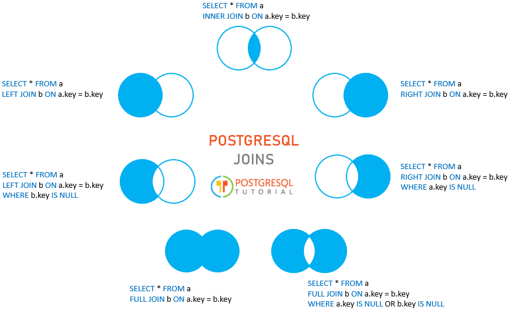

# PostgreSQL Notes (Structured)

## Table of Contents
- [Handle Missing Data](#handle-missing-data)
- [Normal Forms](#normal-forms)
- [Joins](#joins)
- [DCL](#dcl)
- [DML](#dml)
- [DDL](#ddl)
- [Keys and Constraints](#keys-and-constraints)
- [Key Types (Conceptual)](#key-types-conceptual)
- [Query Planning](#query-planning)
- [Indexes](#indexes)
- [Views](#views)
- [Window Functions](#window-functions)
- [Grouping Extensions](#grouping-extensions)
- [`EXISTS`](#exists)
- [CTE](#cte)
- [Transactions](#transactions)
- [Pattern Matching (`LIKE`)](#pattern-matching-like)
- [Fetch / Pagination](#fetch--pagination)
- [Join Algorithms (Planner)](#join-algorithms-planner)
- [Pivot and Unpivot](#pivot-and-unpivot)
- [Lateral Join](#lateral-join)
- [Data Anomalies](#data-anomalies)
- [Useful Functions](#useful-functions)
- [Quick Reminders](#quick-reminders)

## Handle Missing Data
- Use `COALESCE` to replace `NULL` values.
- Use `CASE` when replacement logic depends on conditions.

```sql
SELECT COALESCE(discount, 0) AS discount_value
FROM prices;
```

## Normal Forms
- `1NF`: Atomic values only, no repeating groups.
- `2NF`: No partial dependency on part of a composite key.
- `3NF`: No transitive dependencies.
- `BCNF`: If `A -> B`, then `A` must be a super key.
- `4NF`: No non-trivial multivalued dependencies.

## Joins


### Anti Join
```sql
SELECT a.*
FROM a
LEFT JOIN b ON b.id = a.id
WHERE b.id IS NULL;
```

### Semi Join
```sql
SELECT a.*
FROM a
WHERE EXISTS (
  SELECT 1
  FROM b
  WHERE b.id = a.id
);
```

## DCL
### Commands
- `GRANT`
- `REVOKE`

```sql
GRANT privilege_list
ON object_name
TO user_name;

REVOKE privilege_list
ON object_name
FROM user_name;
```

## DML
### `SELECT INTO`
Creates a new table from a query result.

```sql
SELECT select_list
INTO [TEMPORARY | TEMP | UNLOGGED] [TABLE] new_table_name
FROM table_name
WHERE search_condition;
```

### `INSERT`
`RETURNING` can return inserted rows.

```sql
INSERT INTO table_name (column1, column2)
VALUES (value1, value2)
RETURNING *;
```

```sql
INSERT INTO links (url, name)
VALUES ('http://www.oreilly.com', 'O''Reilly Media');
```

### `UPDATE`
```sql
UPDATE table_name
SET column1 = value1,
    column2 = value2
WHERE condition
RETURNING *;
```

```sql
UPDATE t1
SET c1 = new_value
FROM t2
WHERE t1.c2 = t2.c2;
```

### `DELETE`
PostgreSQL does not support `DELETE JOIN`, but supports `USING`.

```sql
DELETE FROM table_name
WHERE condition
RETURNING *;
```

```sql
DELETE FROM contacts
USING blacklist
WHERE contacts.phone = blacklist.phone;
```

### Merge / Upsert
`ON CONFLICT` is available in PostgreSQL `9.5+`.

```sql
INSERT INTO table_name (column_list)
VALUES (value_list)
ON CONFLICT target
DO NOTHING;
```

```sql
INSERT INTO customers (name, email)
VALUES ('Microsoft', 'hotline@microsoft.com')
ON CONFLICT (name)
DO UPDATE SET email = EXCLUDED.email || ';' || customers.email;
```

## DDL
### `CREATE TABLE`
```sql
CREATE TABLE [IF NOT EXISTS] table_name (
  column1 datatype(length) column_constraint,
  column2 datatype(length) column_constraint,
  table_constraints
);
```

### `CREATE TABLE AS`
Preferred over `SELECT INTO` for clarity.

```sql
CREATE TABLE new_table_name AS
SELECT ...
FROM ...;
```

### `ALTER TABLE`
Common operations:
- Add/drop column
- Rename column/table
- Change default
- Set/drop `NOT NULL`
- Add constraints

```sql
ALTER TABLE table_name
ADD COLUMN column_name datatype column_constraint;
```

```sql
ALTER TABLE table_name
RENAME COLUMN old_name TO new_name;
```

### `DROP TABLE`
```sql
DROP TABLE [IF EXISTS] table_name [CASCADE | RESTRICT];
```

### `TRUNCATE`
Faster than deleting all rows and can reset identity values.

```sql
TRUNCATE TABLE table_name RESTART IDENTITY;
```

## Keys and Constraints
### Primary Key
- Uniquely identifies each row.
- Implies `NOT NULL` + `UNIQUE`.
- One per table.

```sql
CREATE TABLE t (
  c1 data_type,
  c2 data_type,
  PRIMARY KEY (c1, c2)
);
```

```sql
ALTER TABLE table_name
ADD PRIMARY KEY (column_1, column_2);
```

```sql
ALTER TABLE vendors
ADD COLUMN id SERIAL PRIMARY KEY;
```

### Foreign Key
```sql
[CONSTRAINT fk_name]
FOREIGN KEY (fk_columns)
REFERENCES parent_table(parent_key_columns)
[ON DELETE delete_action]
[ON UPDATE update_action]
```

```sql
ALTER TABLE child_table
ADD CONSTRAINT fk_name
FOREIGN KEY (fk_columns)
REFERENCES parent_table (parent_key_columns);
```

Common `ON DELETE` options:
- `SET NULL`
- `CASCADE`
- `SET DEFAULT`

### Check Constraint
```sql
CREATE TABLE employees (
  id SERIAL PRIMARY KEY,
  first_name VARCHAR(50),
  last_name VARCHAR(50),
  birth_date DATE CHECK (birth_date > '1900-01-01'),
  joined_date DATE CHECK (joined_date > birth_date),
  salary NUMERIC CHECK (salary > 0)
);
```

### Unique Constraint / Index
```sql
CREATE TABLE t (
  c1 data_type,
  c2 data_type,
  c3 data_type,
  UNIQUE (c2, c3)
);
```

```sql
CREATE UNIQUE INDEX CONCURRENTLY equipment_equip_id
ON equipment (equip_id);

ALTER TABLE equipment
ADD CONSTRAINT unique_equip_id
UNIQUE USING INDEX equipment_equip_id;
```

### Not Null
```sql
ALTER TABLE table_name
ALTER COLUMN column_name SET NOT NULL;
```

Special case:
```sql
CHECK (column IS NOT NULL)
```

## Key Types (Conceptual)
- `Surrogate Key`: Artificial identifier (often auto-incremented).
- `Candidate Key`: Minimal set of attributes that can uniquely identify a row.
- `Primary Key`: Chosen candidate key.
- `Alternate Key`: Candidate key not chosen as primary key.
- `Super Key`: Any attribute set that uniquely identifies rows.

## Query Planning
## `EXPLAIN`
Shows planner decisions: scans, joins, estimated rows, and costs.

```sql
EXPLAIN [(option [, ...])] sql_statement;
```

Options include:
- `ANALYZE`
- `VERBOSE`
- `COSTS`
- `BUFFERS`
- `TIMING`
- `SUMMARY`
- `FORMAT {TEXT | XML | JSON | YAML}`

Safe analysis pattern for write statements:

```sql
BEGIN;
  EXPLAIN ANALYZE sql_statement;
ROLLBACK;
```

## Indexes
An index is a separate structure (often `B-tree`) that speeds reads at write/storage cost.

### Create / Drop
```sql
CREATE INDEX index_name
ON table_name [USING method] (
  column_name [ASC | DESC] [NULLS {FIRST | LAST}],
  ...
);
```

```sql
DROP INDEX [CONCURRENTLY] [IF EXISTS] index_name [CASCADE | RESTRICT];
```

`DROP INDEX CONCURRENTLY` limitations:
- No `CASCADE`
- Cannot run inside a transaction block

### Inspect Indexes
```sql
SELECT tablename, indexname, indexdef
FROM pg_indexes
WHERE schemaname = 'public'
ORDER BY tablename, indexname;
```

```sql
\d table_name
```

### Index Types
#### B-tree
- Default
- Great for range and equality predicates (`<, <=, =, >=, BETWEEN, IN`)
- Supports prefix `LIKE 'foo%'`

#### Hash
- Equality-only (`=`)

```sql
CREATE INDEX idx_name
ON table_name USING HASH (col);
```

#### GIN
- Good for multi-valued data (`jsonb`, arrays, `hstore`, ranges).

#### BRIN
- Small and cheap for very large, naturally ordered data.

#### GiST / SP-GiST
- Flexible trees for geometric, full-text, and partitioned space use cases.

### Other Index Patterns
- `UNIQUE` index enforces uniqueness (multiple `NULL` values are allowed).
- Expression index:

```sql
CREATE INDEX idx_expr
ON table_name (expression);
```

- Partial index:

```sql
CREATE INDEX idx_customer_inactive
ON customer (active)
WHERE active = 0;
```

### REINDEX vs DROP + CREATE
- `REINDEX`: blocks writes, keeps table readable.
- `DROP/CREATE`: can cause larger lock windows depending on mode and usage.

### Clustered vs Non-clustered (PostgreSQL)
- PostgreSQL tables are heap-organized.
- `CLUSTER` rewrites a table once using index order, but order is not automatically maintained.

## Views
### View
A view is a stored query exposed as a virtual table.

### Materialized View
Stores query results physically.

```sql
CREATE MATERIALIZED VIEW view_name
AS query
WITH [NO] DATA;

REFRESH MATERIALIZED VIEW [CONCURRENTLY] view_name;
```

`CONCURRENTLY` requires a `UNIQUE` index on the materialized view.

### Recursive View
```sql
CREATE RECURSIVE VIEW reporting_line (employee_id, subordinates) AS
SELECT employee_id, full_name
FROM employees
WHERE manager_id IS NULL
UNION ALL
SELECT e.employee_id, rl.subordinates || ' > ' || e.full_name
FROM employees e
JOIN reporting_line rl ON e.manager_id = rl.employee_id;
```

## Window Functions
Common functions:
- `row_number()`
- `rank()`
- `dense_rank()`
- `percent_rank()`
- `cume_dist()`
- `ntile(n)`
- `lag(col, n)`
- `lead(col, n)`
- `nth_value(col, n)`
- Aggregates with window (`min/max/sum/avg`)
- `FILTER (...)` with aggregates/windows

```sql
SELECT
  name,
  weight,
  ntile(2) OVER ntile_window AS by_half,
  ntile(3) OVER ntile_window AS thirds
FROM cats
WINDOW ntile_window AS (ORDER BY weight)
ORDER BY weight, name;
```

Note: with `ORDER BY` and default window frame, aggregate windows act like running totals.

## Grouping Extensions
### `GROUPING SETS`
```sql
SELECT c1, c2, aggregate_function(c3)
FROM table_name
GROUP BY GROUPING SETS (
  (c1, c2),
  (c1),
  (c2),
  ()
);
```

`GROUPING(column)` returns:
- `0` if column is in current grouping set
- `1` otherwise

### `ROLLUP` and `CUBE`
`ROLLUP(c1, c2, c3)` produces:
- `(c1, c2, c3)`
- `(c1, c2)`
- `(c1)`
- `()`

`CUBE(c1, c2, c3)` produces all combinations.

## `EXISTS`
```sql
SELECT column1
FROM table_1
WHERE EXISTS (
  SELECT 1
  FROM table_2
  WHERE table_2.column_2 = table_1.column_1
);
```

## CTE
Improves readability, modularity, and supports recursion.

```sql
WITH cte_name (column_list) AS (
  CTE_query_definition
)
SELECT ...
FROM cte_name;
```

### Recursive CTE
```sql
WITH RECURSIVE cte_name AS (
  -- non-recursive term
  SELECT ...
  UNION ALL
  -- recursive term
  SELECT ...
  FROM ...
  JOIN cte_name ...
)
SELECT * FROM cte_name;
```

Guideline:
- `UNION` removes duplicates each iteration.
- `UNION ALL` is usually faster; deduplicate at the end if needed.

## Transactions
ACID:
- `Atomicity`
- `Consistency`
- `Isolation`
- `Durability`

```sql
BEGIN;

UPDATE accounts
SET balance = balance - 1000
WHERE id = 1;

UPDATE accounts
SET balance = balance + 1000
WHERE id = 2;

COMMIT;
```

`ROLLBACK` cancels uncommitted work.

## Pattern Matching (`LIKE`)
- `%` matches any sequence.
- `_` matches one character.
- `ILIKE` is case-insensitive.

## Fetch / Pagination
`FETCH` is SQL-standard alternative to `LIMIT`.

```sql
SELECT film_id, title
FROM film
ORDER BY title
OFFSET 5 ROWS
FETCH FIRST 5 ROWS ONLY;
```

## Join Algorithms (Planner)
- `Nested Loop Join`: often for small inputs or non-equality predicates.
- `Hash Join`: common for equality joins without useful index path.
- `Merge Join`: efficient when both sides are sorted / sortable.

## Pivot and Unpivot
### Static Pivot
Use `CASE` or `FILTER`.

```sql
SELECT
  city,
  SUM(raindays) FILTER (WHERE year = 2013) AS "2013",
  SUM(raindays) FILTER (WHERE year = 2014) AS "2014"
FROM rainfall
GROUP BY city
ORDER BY city;
```

### Dynamic Pivot (JSON)
```sql
SELECT city, json_object_agg(year, total ORDER BY year)
FROM (
  SELECT city, year, SUM(raindays) AS total
  FROM rainfall
  GROUP BY city, year
) s
GROUP BY city
ORDER BY city;
```

### Client-side Pivot (`psql`)
Use `\crosstabview` after query output.

### Unpivot
```sql
SELECT key, value
FROM (
  SELECT row_to_json(t.*) AS line
  FROM rain_months t
) r
CROSS JOIN LATERAL json_each_text(r.line);
```

## Lateral Join
Use when inner query depends on values from outer rows.

```sql
SELECT ...
FROM outer_table o
LEFT JOIN LATERAL (
  SELECT ...
  FROM inner_table i
  WHERE i.user_id = o.user_id
  ORDER BY i.time
  LIMIT 1
) x ON true;
```

## Data Anomalies
- `Insert Anomaly`: cannot insert child data without required parent.
- `Update Anomaly`: duplicate data updated inconsistently.
- `Delete Anomaly`: deleting one fact removes unrelated needed data.

## Useful Functions
```sql
SUBSTRING(string, start_position, length);

EXTRACT(YEAR  FROM birth_date);
EXTRACT(MONTH FROM birth_date);
EXTRACT(DAY   FROM birth_date);

SELECT array_agg(time) FROM runners;
```

## Quick Reminders
- Retrieve most recent row per user (`ROW_NUMBER()` + partition).
- Compare anti-join forms carefully when `NULL`s are involved.
- Revisit index fragmentation / maintenance strategy during performance tuning.
