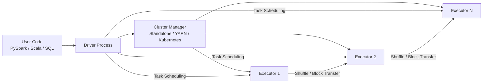
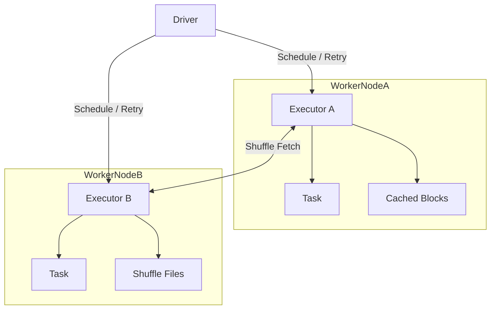
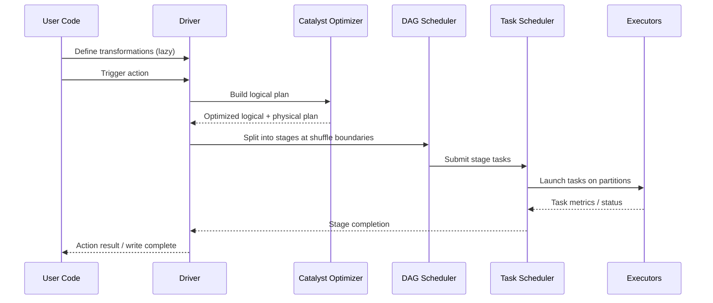
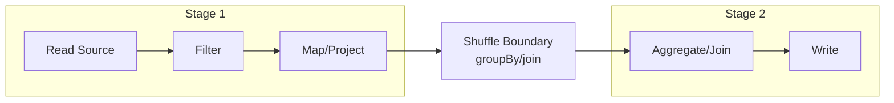

# Spark Architecture Overview

## Overview
Spark is a distributed compute engine designed for large-scale batch and streaming analytics.
Its architecture separates coordination (Driver), execution (Executors), and resource allocation (Cluster Manager).

At a high level:
- You define transformations/actions using DataFrame/Dataset/RDD APIs.
- Spark builds a plan and turns it into executable stages.
- Executors run tasks on partitions and exchange data through shuffle when needed.

## High-Level Architecture
Spark runtime has three main layers:

1. API and planning layer:
- DataFrame/Dataset/RDD APIs
- Spark SQL parser/analyzer
- Catalyst optimizer (logical/physical plan optimization)

2. Execution layer:
- DAG Scheduler splits jobs into stages
- Task Scheduler launches tasks on executors
- Tungsten/Whole-Stage Codegen optimize memory and CPU execution

3. Resource layer:
- Cluster Manager provisions CPU/memory for executors
- Executors run JVM processes close to data where possible

Why this matters:
- Most performance issues come from plan shape (joins/shuffles) and resource pressure (memory/CPU/network).

---

## Driver and Executor Roles

### Driver
The Driver is the control plane of a Spark application.

Responsibilities:
- Maintains SparkSession/SparkContext
- Builds logical/physical execution plans
- Tracks metadata (stages, tasks, lineage)
- Schedules tasks and handles retries
- Aggregates task results and writes final action outputs

Failure implication:
- If Driver dies, application stops.

### Executors
Executors are worker JVMs on cluster nodes.

Responsibilities:
- Execute tasks on input partitions
- Cache persisted data blocks
- Perform local aggregations and map-side combine
- Read/write shuffle data
- Report task status and metrics to Driver

Failure implication:
- Lost executor tasks are retried elsewhere (up to retry limits).

---

## Cluster Managers
Spark supports multiple cluster managers. The Spark execution model is mostly consistent across them.

### Standalone
- Native Spark cluster mode
- Simple setup for dedicated Spark clusters
- Lower operational complexity for small/medium deployments

### YARN
- Common in Hadoop ecosystems
- Integrates with HDFS and existing enterprise schedulers/queues
- Useful where YARN already governs shared infrastructure

### Kubernetes
- Cloud-native deployment model
- Strong integration with container tooling and autoscaling workflows
- Preferred in modern platform teams with K8s-first operations

Selection heuristics:
- Existing Hadoop platform -> YARN
- Container-native platform -> Kubernetes
- Lightweight dedicated Spark cluster -> Standalone

---

## Execution Workflow (From Code to Tasks)

When an action is called (`count`, `write`, `collect`, etc.), Spark executes this flow:

Key concept:
- Transformations are lazy; actions trigger execution.

---

## Jobs, Stages, and Tasks

- Job: created per action.
- Stage: set of tasks without shuffle boundary crossing.
- Task: smallest unit, typically one partition of work.

Wide operations (`join`, `groupBy`, `orderBy`, `distinct`) introduce shuffle and therefore stage boundaries.

Performance implication:
- Reducing unnecessary shuffle is often the highest-impact optimization.

---

## Memory and Data Movement

Spark spends time in three expensive areas:

1. Shuffle I/O:
- Network transfer between executors
- Disk spill when memory is insufficient

2. Serialization/deserialization:
- Python-JVM boundary in PySpark
- Object encoding/decoding overhead

3. GC and memory pressure:
- Large joins/aggregations can cause spills and long GC pauses

Operational signs of trouble:
- Skewed stage durations
- High spill metrics
- Executor lost / OOM errors
- Very large shuffle read/write per stage

---

## Failure Handling and Fault Tolerance

Spark uses lineage and task retry for resilience.

- If task fails: retry task on same/different executor.
- If executor fails: rerun lost partitions/tasks elsewhere.
- For RDD/DataFrame lineage: recomputation rebuilds lost intermediate data unless checkpointed.

Checkpointing is useful when lineage graphs become too deep or recomputation cost is high.

---

## Practical Architecture-Level Tuning Levers

High-impact levers (in order):

1. Query shape:
- Push filters early
- Project fewer columns
- Choose correct join strategy (broadcast vs shuffle)

2. Partition strategy:
- Avoid too few partitions (underutilization)
- Avoid too many tiny partitions (scheduler overhead)

3. Skew mitigation:
- AQE skew join
- Pre-aggregation
- Salting heavy keys

4. Resource sizing:
- Executor memory/cores matched to workload
- Shuffle partitions aligned to cluster size and data volume

---

## Common Misconceptions

- "Spark is always in-memory": false; shuffle spill and disk I/O are common.
- "More executors always means faster": false; can increase shuffle/network overhead.
- "Caching everything helps": false; cache only reused, expensive intermediates.
- "UDF is same as built-in function": false; UDFs often reduce optimizer effectiveness.

---

## Why This Matters
Understanding Spark architecture improves:
- Performance debugging (`explain`, Spark UI stage/task metrics)
- Reliable scaling decisions (joins, partitioning, memory)
- Correct cluster sizing and cost/performance tradeoffs

## Related
- [[04-Data Engineering Library/Spark Deep Internals/Spark-Performance-Tuning-Guide.md]]
- [[04-Data Engineering Library/Spark Deep Internals/Spark-Join-Algorithms.md]]
- [[04-Data Engineering Library/Spark Deep Internals/AQE-Mechanics.md]]
