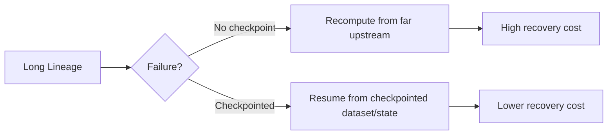
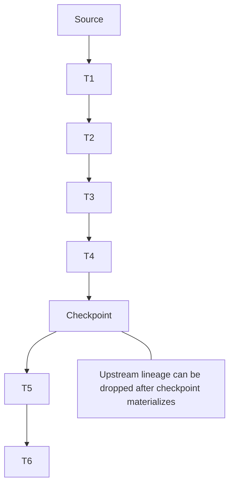
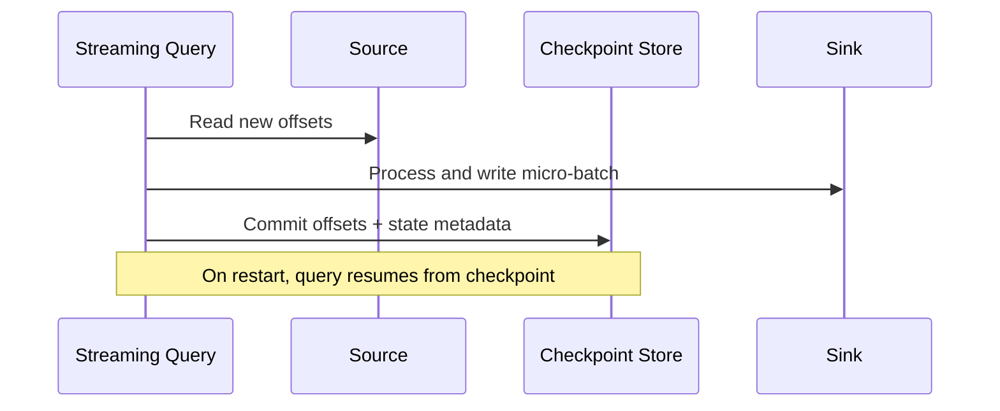

# Spark Checkpointing

## Overview
Checkpointing in Spark is a fault-tolerance and lineage-control technique.
It materializes data/state to reliable storage so Spark can recover without replaying the full upstream lineage.

You use checkpointing mainly to:
- Truncate very long lineage chains
- Improve recovery behavior in iterative/streaming pipelines
- Stabilize execution when recomputation cost is high



## What Checkpointing Is (and Is Not)

Checkpointing is:
- Durable materialization to reliable storage (HDFS/S3/DBFS-compatible filesystem)
- A lineage truncation boundary

Checkpointing is not:
- A replacement for caching in normal repeated reads
- A universal performance booster (it introduces write/read overhead)

Rule of thumb:
- Cache for speed during normal execution.
- Checkpoint for recovery and lineage truncation.

---

## RDD Checkpointing

RDD has explicit checkpoint APIs:

```python
sc.setCheckpointDir("s3://my-checkpoints/spark/")

rdd2 = rdd.map(...).filter(...)
rdd2.checkpoint()
rdd2.count()  # action triggers checkpoint materialization
```

Behavior:
- Checkpoint is lazy until an action runs.
- After materialization, lineage can be truncated.

When useful:
- Iterative algorithms with deep dependency chains
- Expensive upstream recomputation

---

## DataFrame / Dataset Checkpointing

DataFrame checkpoint API (Spark session needed):

```python
spark.sparkContext.setCheckpointDir("s3://my-checkpoints/spark/")

df_cp = df.checkpoint(eager=False)  # lazy checkpoint
# or df.checkpoint(eager=True) for immediate materialization
```

Local checkpoint:

```python
df_local = df.localCheckpoint(eager=False)
```

Difference:
- `checkpoint()` -> reliable filesystem, fault-tolerant
- `localCheckpoint()` -> executor-local storage, faster but not fault-tolerant

Use `localCheckpoint` only for performance shortcuts where data loss/recompute is acceptable.

---

## Lineage Truncation in Practice

Long lineage can cause:
- Slow planning and recovery
- Large DAG complexity
- High recomputation cost after executor failure

Checkpointing inserts a boundary:



Practical placement:
- After heavy/expensive normalization stage
- Between iterative loops
- Before branches with multiple expensive downstream actions

---

## Checkpointing vs Persist/Caching

### Persist/Cache
- Stores data in memory/disk for faster reuse
- Not necessarily durable across failures
- Best for repeated access in same application lifecycle

### Checkpoint
- Writes to reliable storage
- Truncates lineage
- Best for recovery and long lineage control

Common hybrid pattern:

```python
hot = df.persist()
hot.count()  # materialize cache

stable = hot.checkpoint(eager=False)
stable.count()  # materialize checkpoint

hot.unpersist()
```

Why this pattern:
- Persist can speed checkpoint materialization by avoiding repeated upstream recompute.

---

## Structured Streaming Checkpoints

In Structured Streaming, checkpoint location is mandatory for reliable progress and state recovery.

```python
(
  stream_df.writeStream
    .format("parquet")
    .option("path", "s3://my-output/path/")
    .option("checkpointLocation", "s3://my-checkpoints/stream-job-a/")
    .start()
)
```

Checkpoint contents typically include:
- Source offsets
- Commit logs
- State store metadata (for stateful queries)

Why critical:
- Enables restart from last committed progress.
- Prevents duplicate/incorrect processing behavior in many scenarios.



---

## Storage Considerations for Checkpoints

Use reliable, distributed storage:
- HDFS, cloud object storage, or managed distributed FS

Recommendations:
- Separate checkpoint paths per application/query
- Avoid sharing checkpoint dirs across unrelated jobs
- Use lifecycle/retention policies for old checkpoint cleanup

Caveat with object stores:
- Higher latency for many small metadata operations can impact startup/recovery times.

---

## Failure Scenarios and Recovery

### Without checkpoint
- Failure can force recomputation from deep lineage roots.
- Recovery time may be long and expensive.

### With checkpoint
- Recovery starts from persisted checkpoint boundary/state.
- Lower recomputation depth and typically faster recovery.

Notable caveat:
- If checkpoint files are lost/corrupted, recovery guarantees are compromised.

---

## Performance Tradeoffs

Checkpoint adds overhead:
- Extra I/O for writing checkpoint data
- Possible read overhead after truncation boundary

Use when:
- Recompute cost > checkpoint I/O cost
- Recovery reliability is important
- Lineage depth is becoming operationally risky

Avoid overuse:
- Excessive checkpointing can slow pipelines and increase storage cost.

---

## Practical Decision Framework

```mermaid
flowchart TD
    A[Need checkpoint?] --> B{Streaming stateful query?}
    B -->|Yes| C[Use durable checkpointLocation]
    B -->|No| D{Lineage deep / recompute expensive?}
    D -->|Yes| E[Use checkpoint() at stable boundary]
    D -->|No| F{Only repeated reads in same job?}
    F -->|Yes| G[Use persist/cache]
    F -->|No| H[No checkpoint/cache needed]
```

---

## Common Gotchas

- Calling `checkpoint()` but never triggering an action.
- Forgetting `setCheckpointDir` (RDD/DataFrame checkpoint setup).
- Using `localCheckpoint` and expecting fault tolerance.
- Reusing one checkpoint path across different query plans.
- Assuming checkpoint always improves runtime (it can slow jobs).
- In streaming, changing query logic while reusing old checkpoint can cause incompatibilities.

---

## Best Practices Checklist

1. Set checkpoint directory explicitly and reliably.
2. Place checkpoint after expensive/stable transformation boundaries.
3. Use cache + checkpoint together when materialization cost is high.
4. Use unique checkpoint paths per streaming query/job.
5. Monitor checkpoint size/latency and manage retention.
6. Validate recovery by testing restart scenarios.

---

## Why It Matters
Good checkpoint strategy improves:
- Recovery time and reliability
- Stability of long/iterative pipelines
- Operability of streaming stateful jobs

## Related
- [[04-Data Engineering Library/Spark Deep Internals/Spark-Performance-Tuning-Guide.md]]
- [[04-Data Engineering Library/Spark Deep Internals/Spark-Caching-Strategies.md]]
- [[04-Data Engineering Library/Spark Deep Internals/Spark-Debugging-Playbook.md]]
