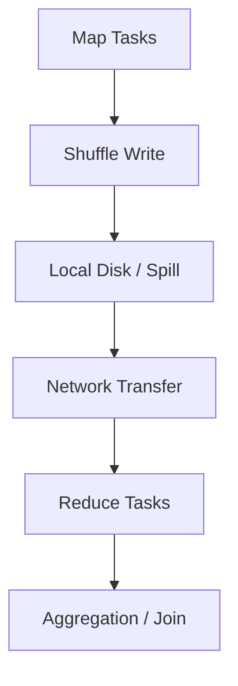
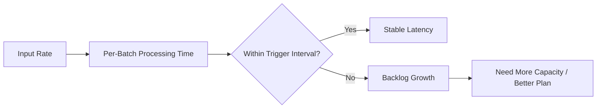

# Spark Cluster Sizing Guide

## Overview
Cluster sizing in Spark is the process of mapping workload characteristics to:
- Number of executors
- Cores per executor
- Memory per executor
- Disk and network capacity for shuffle-heavy stages

Good sizing is not "bigger cluster = faster job." It is a balance across CPU parallelism, memory pressure, shuffle behavior, and reliability targets.

This guide focuses on *how to reason* about sizing, then turn that into initial configs you can validate with Spark UI metrics.


## Sizing Goals and Constraints

Sizing choices should satisfy all four goals:

1. Meet SLA:
- Batch completion window, or
- Streaming latency and throughput targets

2. Keep failure recovery acceptable:
- Task retries and executor loss should not collapse the run window

3. Avoid chronic resource waste:
- Low CPU utilization with high cost usually means over-provisioned cluster

4. Maintain stable operation under data growth:
- Headroom for seasonal spikes and schema-driven growth

Typical constraints:
- Node types available in your platform
- Cluster manager quotas (YARN queues, K8s namespace limits)
- Budget ceilings

---

## Step 1: Build a Workload Profile

Before picking executors, profile the job:

- Input data volume (daily, peak, and 95th percentile)
- File layout and compression (many small files vs few large files)
- Dominant operations (`join`, `groupBy`, `window`, `sort`, `explode`)
- Join strategy candidates (broadcast vs shuffle join)
- Skewed keys and high-cardinality aggregations
- Batch vs streaming mode and SLA

Why this matters:
- CPU-bound pipelines scale differently than shuffle/memory-bound pipelines.
- Most bad sizing decisions come from skipping this step.

---

## Step 2: CPU Sizing (Parallelism First)

CPU is the primary throughput driver when the workload is compute-heavy.

Baseline concepts:
- One Spark task occupies one core while running.
- Total runnable task capacity is roughly total executor cores.
- Too few cores -> underutilization and long stage times.
- Too many cores per executor -> contention, worse GC, and larger failure blast radius.

Practical heuristics:
- Start with `4-8` cores per executor for JVM stability.
- Keep at least `2-3x` as many tasks as total cores for good scheduling elasticity.
- For wide stages, tune `spark.sql.shuffle.partitions` (or rely on AQE coalesce behavior).

Quick planning formula:

```text
target_total_cores ~= max_concurrent_tasks_needed
executors ~= ceil(target_total_cores / cores_per_executor)
```

Use Spark UI to validate:
- If executor CPU is consistently low and tasks are waiting on I/O/shuffle fetch, CPU alone is not your bottleneck.
- If tasks queue for long periods and CPU is saturated, add cores or reduce task runtime.

---

## Step 3: Memory Sizing (Execution + Storage + Overhead)

Memory sizing protects against:
- OOM failures
- Excessive spill to disk
- Long GC pauses

Understand Spark memory buckets (simplified):
- Execution memory: shuffle, joins, sorts, aggregations
- Storage memory: cached/persisted data
- Overhead memory: JVM/Python/native overhead, off-heap structures

Key risks:
- Under-sized memory causes spill storms during join/aggregation stages.
- Over-sized executors can increase GC pause duration and retry cost.

Practical starting points:
- Use moderate executor size (`8-32 GB` heap range is often operationally stable).
- Reserve adequate overhead, especially for PySpark (`spark.executor.memoryOverhead`).
- For cache-heavy workloads, budget storage memory intentionally; do not assume default fractions are enough.

Validation signals in Spark UI:
- High spill metrics (`memory spill`, `disk spill`)
- Executor lost due to memory errors
- Long GC time share relative to task runtime

---

## Step 4: Shuffle, Disk, and Network Sizing

Many Spark workloads are shuffle-bound, not CPU-bound.

Shuffle-intensive operations:
- `join` (except broadcast cases)
- `groupBy` / `distinct`
- `orderBy` / global sorts
- Repartitioning

Sizing implications:
- Disk throughput must handle spill + shuffle file writes
- Network throughput must handle remote shuffle reads
- Insufficient local disk can fail stages even when CPU and heap look fine

Operational guidance:
- Prefer fast local SSD/NVMe for executor local dirs when possible
- Ensure enough ephemeral disk for peak shuffle stages
- Watch skew: a single heavy partition can dominate stage completion time



---

## Executor Shape: Many Small vs Few Large

Choosing executor shape is a tradeoff:

Many smaller executors:
- Better parallelism granularity
- Smaller failure impact
- Often easier GC behavior
- Higher scheduler and connection overhead

Fewer larger executors:
- Lower scheduler overhead
- Can reduce shuffle connection fan-out
- Higher GC risk and larger failure blast radius

Common default for mixed workloads:
- Prefer moderate executors instead of very large ones.

---

## Batch Sizing Approach

For batch pipelines:

1. Estimate peak input volume for SLA window.
2. Identify the heaviest stage class (compute vs shuffle-heavy).
3. Pick an initial executor shape.
4. Set partition counts to keep cores busy without huge scheduler overhead.
5. Run representative load and inspect Spark UI.
6. Iterate with one major variable at a time (cores, memory, partitions, join strategy).

Batch-specific metrics to track:
- Stage runtime distribution (p50/p95)
- Shuffle read/write size per stage
- Spill volume
- GC share
- Cost per successful TB processed

---

## Streaming Sizing Approach

For Structured Streaming, size for steady-state and burst conditions.

Capacity rule:
- Processing time per micro-batch must stay below trigger interval (with safety margin).

Include state-store pressure:
- Stateful aggregations/joins grow memory and checkpoint/state I/O.
- Compaction and maintenance behavior can change latency.

Streaming checklist:
- Validate worst-case burst rate, not just average ingest.
- Size checkpoint/state storage IOPS and latency.
- Leave headroom for replay after outages.



---

## Dynamic Allocation and Autoscaling

Dynamic allocation/autoscaling can reduce cost, but must be workload-aware.

Helpful when:
- Workload has clear idle and burst phases
- Backlog tolerance is acceptable

Risky when:
- Jobs are latency-critical and scale-up lag is expensive
- Shuffle-heavy stages repeatedly thrash during scale changes

Guidelines:
- Set sensible min/max executor bounds
- Keep a warm baseline for latency-sensitive jobs
- Combine with AQE and partition tuning; scaling cannot fix poor query shape

---

## Practical Initial Sizing Recipe

Use this as an initial pass, then tune with metrics:

1. Choose `cores_per_executor` in `4-8`.
2. Choose `executor_memory` in a moderate range (often `8-32 GB`) and add realistic overhead.
3. Compute total cores needed from SLA and observed task runtime.
4. Derive executor count:

```text
num_executors = ceil(target_total_cores / cores_per_executor)
```

5. Set partitioning so active tasks exceed total cores (`~2-3x` target).
6. Run production-like data and inspect:
- CPU utilization
- Spill and shuffle metrics
- GC overhead
- Skewed tasks and long tails

7. Iterate:
- CPU saturated + low spill -> add cores
- Spill/GC high -> increase memory or reduce per-task data
- Long tails -> fix skew and repartition strategy

---

## Common Sizing Anti-Patterns

- Blindly maximizing executor size on large nodes
- Sizing only for average volume, ignoring peak days
- Treating partition count as static across all workloads
- Ignoring skew, then compensating by adding hardware
- Scaling cluster size without revisiting join strategy and file layout
- Assuming autoscaling alone will satisfy strict SLA

---

## Validation Metrics (What "Right-Sized" Looks Like)

A right-sized cluster usually shows:
- High but not pinned CPU utilization during heavy stages
- Controlled spill (not chronic spill storms)
- Manageable GC overhead
- Narrow gap between median and tail task durations (low skew impact)
- SLA consistently met at acceptable cost

If these are not true, sizing is still in progress.

---

## Best Practices Checklist

1. Size from workload profile, not node inventory.
2. Use moderate executor shapes first; avoid extremes.
3. Tune partitioning and join strategy before brute-force scaling.
4. Budget memory overhead explicitly, especially for PySpark.
5. Validate with representative peak data.
6. Track cost/performance together, not in isolation.
7. Re-baseline sizing as data and query patterns evolve.

## Why It Matters
Cluster sizing directly drives:
- Runtime predictability
- Platform cost efficiency
- Operational resilience under failures and growth

## Related
- [[04-Data Engineering Library/Spark Deep Internals/Spark-Performance-Tuning-Guide.md]]
- [[04-Data Engineering Library/Spark Deep Internals/Spark-Architecture-Overview.md]]
- [[04-Data Engineering Library/Spark Deep Internals/Spark-Join-Algorithms.md]]
- [[04-Data Engineering Library/Spark Deep Internals/Spark-Checkpointing.md]]
