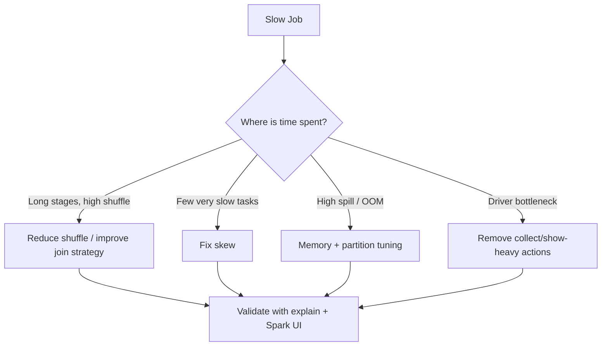
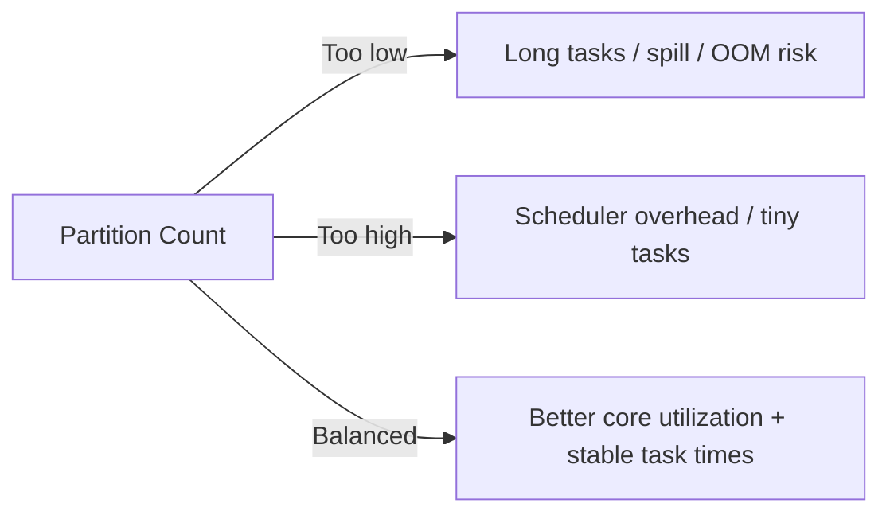
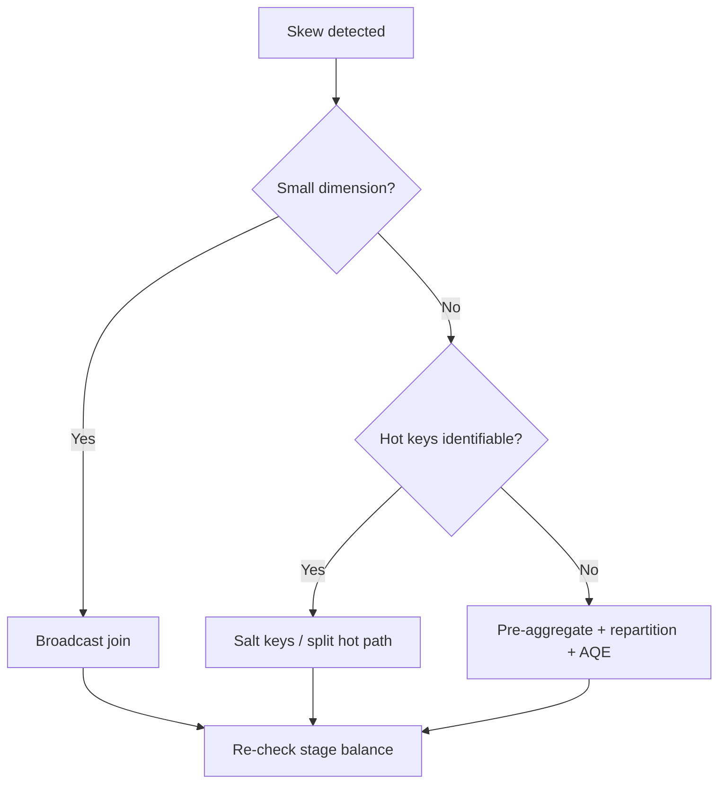
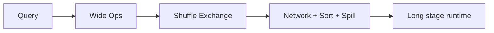

# Spark Performance Tuning Guide

## Overview
Spark performance tuning is primarily about reducing expensive work (shuffle, serialization, skew, spill) and aligning execution shape with cluster resources.

A practical rule:
- Tune query/data shape first.
- Tune partitioning and join strategy second.
- Tune Spark configs third.



## Performance Tuning Workflow (Recommended)

1. Establish baseline:
- Capture wall-clock runtime.
- Capture Spark UI metrics (shuffle read/write, spill, skewed tasks).
- Keep representative data volume.

2. Verify execution plan:
- Use `df.explain("formatted")`.
- Count `Exchange` nodes (shuffle boundaries).
- Check join strategies (`BroadcastHashJoin`, `SortMergeJoin`).

3. Fix high-impact issues:
- Push filters/projection early.
- Select correct join strategy.
- Handle skew and repartition by keys.

4. Re-measure and iterate:
- Change one tuning lever at a time.
- Confirm gain is stable across runs.

---

## Parallelism Settings

Core knobs:
- `spark.sql.shuffle.partitions` (default shuffle partition count)
- `spark.default.parallelism` (RDD path baseline)

Guidance:
- Too low -> large partitions, long tasks, potential OOM/spill.
- Too high -> scheduler overhead and too many small tasks.

Starting heuristic:
- Begin with ~2–4 tasks per executor core for shuffle-heavy pipelines, then validate via task duration/spill.

AQE impact:
- With AQE enabled, Spark can coalesce post-shuffle partitions dynamically.



---

## Partition Sizing

Goal:
- Keep partition sizes large enough to reduce overhead, small enough to avoid spill/OOM.

Practical approach:
- Repartition by heavy join/group keys before wide operations.
- Coalesce before final writes to control file count.

```python
# Example pattern
fact = fact.repartition(400, "customer_id")
out = result.coalesce(80)
```

What to watch in Spark UI:
- Task input size distribution
- Spill (memory/disk)
- Stage time dominated by stragglers

Gotcha:
- Repartitioning repeatedly at multiple points can add unnecessary shuffle.

---

## Skew Mitigation

Skew symptoms:
- Most tasks finish quickly; a few tasks run much longer.
- One/few reducers have massive input.

Mitigation options:
1. AQE skew join (`spark.sql.adaptive.skewJoin.enabled=true`)
2. Broadcast small side where valid
3. Pre-aggregate before joining
4. Key salting for heavy keys
5. Split hot keys into separate handling path



Salting idea:
- Add random salt to skewed side key.
- Duplicate small side across salt values.
- Join on `(key, salt)`.

Tradeoff:
- More data movement on small side, but can drastically reduce stragglers.

---

## Shuffle Optimization

Shuffles are expensive due to network + sort + disk spill.

Common shuffle triggers:
- `join`, `groupBy`, `distinct`, `orderBy`, large `window` operations

High-impact reductions:
- Filter/project before wide ops
- Use `left_semi`/`left_anti` when only existence is needed
- Use broadcast joins for truly small dimensions
- Avoid unnecessary global sort



---

## Join Strategy Tuning

Choose join strategy by size and key distribution:

1. Broadcast Hash Join
- Best when one side is small enough to broadcast.
- Avoids shuffle on large side.

2. Sort Merge Join
- Good for large-large joins.
- Requires shuffle + sort both sides.

3. Shuffle Hash Join (context-dependent)
- Can be useful in some cases but less common as default in modern plans.

Checks:
- Verify actual strategy in physical plan, not assumptions.
- Ensure join key types match to avoid implicit cast costs.

---

## Caching and Persistence

Cache only when:
- Same expensive DataFrame reused across multiple actions/stages.

Do not cache when:
- Dataset used once.
- Dataset too large and causes cache churn.

Pattern:
```python
hot = expensive_df.persist()
hot.count()  # materialize
# reuse hot in multiple downstream actions
hot.unpersist()
```

Gotcha:
- Blind caching can worsen performance due to eviction and GC pressure.

---

## File Layout and Write Path

Format and layout strongly affect downstream read performance.

Recommendations:
- Prefer Parquet/ORC for analytics.
- Partition by common filter columns with moderate cardinality.
- Control output file count to avoid small-files problem.

Small-files symptoms:
- Metadata overhead grows.
- Query planning and listing become slow.

Write strategy:
- Use coalesce/repartition before write based on output size goals.

---

## Memory Pressure and Spill Diagnostics

Signs:
- High spill bytes (memory/disk)
- Executor OOM
- Long GC times

Levers:
- Increase partitions (smaller task working set)
- Reduce row width (drop unused columns early)
- Pre-aggregate earlier
- Increase executor memory only after plan/data-shape fixes

Key principle:
- Hardware/config scaling is last step after query-shape optimization.

---

## AQE (Adaptive Query Execution)

AQE can:
- Coalesce post-shuffle partitions
- Switch join strategy at runtime
- Mitigate skewed partitions

Important settings:
- `spark.sql.adaptive.enabled=true`
- `spark.sql.adaptive.skewJoin.enabled=true`

Caveat:
- AQE improves many cases, but it cannot fully compensate for poor data modeling or heavy skew without additional logic.

---

## Debugging with Spark UI (What to Look At)

In Stages tab:
- Stage duration variance
- Task time distribution
- Shuffle read/write size
- Spill bytes

In SQL tab:
- Physical plan operators and exchanges
- Input row counts and operator bottlenecks

In Executors tab:
- Skewed executor load
- GC time
- Peak memory pressure

Interview-quality explanation:
- "I use UI to identify bottleneck stage, then map it to plan operator and apply targeted fixes (join/partition/skew), then re-measure."

---

## Common Tuning Anti-Patterns

- Tuning configs before checking plan.
- Using Python UDF when built-in SQL functions exist.
- Excessive repartition calls at multiple steps.
- Global `orderBy` without true need.
- `collect()` on large datasets.
- Over-partitioned writes causing tiny files.

---

## Practical Tuning Checklist

1. Confirm logic correctness and sample outputs.
2. Inspect physical plan (`explain`) and identify exchanges.
3. Reduce data volume early (filter + projection).
4. Select join strategy (broadcast vs shuffle).
5. Handle skew (AQE, salting, pre-agg).
6. Tune partitions for balanced task times.
7. Cache selectively for reused intermediates.
8. Optimize write path and file layout.
9. Validate gains using Spark UI metrics.

---

## Why It Matters
Strong Spark tuning discipline yields:
- Lower runtime and cluster cost
- More predictable SLAs
- Fewer production incidents from OOM/skew
- Better scalability as data grows

## Related
- [[04-Data Engineering Library/Spark Deep Internals/Spark-Architecture-Overview.md]]
- [[04-Data Engineering Library/Spark Deep Internals/Spark-Join-Algorithms.md]]
- [[04-Data Engineering Library/Spark Deep Internals/AQE-Mechanics.md]]
- [[04-Data Engineering Library/Spark Deep Internals/Spark-Debugging-Playbook.md]]
