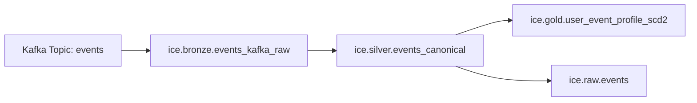

# Architecture

## High-Level Design

## Table Contracts

### Bronze (`ice.bronze.events_kafka_raw`)
- Raw Kafka envelope + payload
- Columns:
  - `kafka_topic`, `kafka_partition`, `kafka_offset`, `kafka_timestamp`
  - `ingest_ts`
  - `raw_value`
- Purpose: replay and audit boundary

### Silver (`ice.silver.events_canonical`)
- Parsed and deduplicated canonical event contract
- Columns:
  - `event_id`, `user_id`, `device_id`, `event_type`, `event_ts`
  - `source_created_ts`, `source_changed_ts`
  - `ingest_ts`, `source_file`, `source_system`
  - `op`, `is_deleted`, `payload_hash`
- Purpose: trusted cleaned stream
- Modeling rule: keep Silver canonical/current-state friendly; avoid default SCD2 in Silver

### SCD2 (`ice.gold.user_event_profile_scd2`)
- Event-derived mutable profile history by `user_id`
- Attributes tracked:
  - `device_id`, `event_type`
- SCD2 columns:
  - `user_id`, `device_id`, `event_type`
  - `valid_from`, `valid_to`, `is_current`
  - `record_hash`, `updated_at`

### Final Source (`ice.raw.events`)
- Final source table for the transformation pipeline
- Keeps base schema expected by `spark_pipeline.sql` and `spark_pipeline.py`
- Adds `source_created_ts` and `source_changed_ts` for stronger lineage and CDC semantics

## Processing Semantics
- Kafka ingestion: at-least-once
- Bronze idempotency: `MERGE` by `(kafka_topic, kafka_partition, kafka_offset)`
- Silver idempotency: dedup by `event_id`
- SCD2 update: incremental `MERGE` from Silver
- Final source upsert: `MERGE` from Silver into `ice.raw.events`

## Bootstrap Strategy
- Preferred:
  - Snapshot historical data from source DB/read replica into Silver.
  - Then ingest CDC/events from Kafka and upsert into Silver.
- Fallback:
  - Kafka-only backfill if and only if retention covers required history.

## Reliability Controls
- Separate checkpoint path per streaming query
- Watermark + dedup window for late/replayed messages
- Replay from Bronze for deterministic reprocessing

## Recommended Orchestration
- `backfill_bronze_from_kafka.py`: one-time historical backfill
- `stream_ingest_bronze.py`: continuous after cutover
- `sql/02_silver_events.sql`: every 5-15 minutes
- `scd2_merge_job.py`: every 15-60 minutes
- `sql/04_final_source_table.sql`: after Silver refresh
